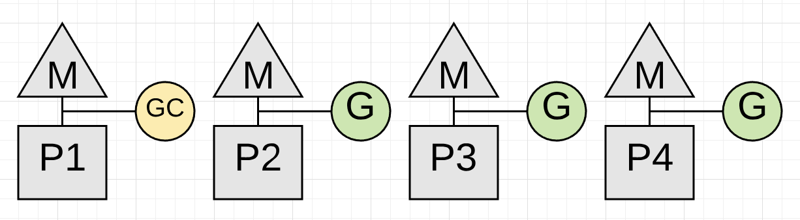

## 前言
该系列一共有3篇文章，整体介绍 Go 语言中的垃圾回收器的机制和语义。三篇文章重点内容如下：
1. [垃圾回收器 - 相关语义](https://www.ardanlabs.com/blog/2018/12/garbage-collection-in-go-part1-semantics.html)
2. [垃圾回收器 - 监控跟踪](https://www.ardanlabs.com/blog/2019/05/garbage-collection-in-go-part2-gctraces.html)
3. [垃圾回收器 - 回收频率](https://www.ardanlabs.com/blog/2019/07/garbage-collection-in-go-part3-gcpacing.html)

## 语义

### 介绍

垃圾回收器主要有三个职责：1. 跟踪堆内存分配；2. 释放无用内存；3. 保持有用内存的分配状态。编程语言的垃圾回收器实现可能会很复杂，但是程序员并不需要理解其细节。而且随着语言的虚拟机或者运行时迭代，垃圾回收器的实现往往也在更新迭代。 对于程序员最重要的是了解其所用语言的垃圾回收器的行为，同时建立良好的编程模型，在不关注垃圾回收实现原理的情况下对垃圾回收的行为给以足够的关注和理解。   
在1.12版本中，Go 语言基于无分代三色标记及清理实现垃圾回收器。如果你想可视化的观察整个标记清理过程，建议阅读[Ken Fox的介绍文章](https://spin.atomicobject.com/2014/09/03/visualizing-garbage-collection-algorithms)。Go 语言垃圾回收器每个版本都会迭代，所以任何介绍其细节的文章都将随着 Go 新版发布而过时。与实现的多变性不同，垃圾回收器的主要行为基本是长期稳定的。所以本篇将专注于垃圾回收器的行为并且着重介绍如何对这些行为表示足够的尊重及理解，这将使你成为更加优秀的 Go 语言开发者。  

### 重要背景 - 堆不是容器

在 Go 语言中，不建议将堆解释成可以从中存储或释放值的容器。重要的是理解实现堆的内存并不是线性的。你可以认为在进程空间中为应用所保留的任何内存空间都可以供堆使用。堆内存在虚拟或物理的内存中的存储位置和我们讨论的模型无关。理解这些将有助于你理解 Go 语言垃圾回收器的行为。

### 回收器行为

Go 语言中垃圾回收共有三个阶段，其中两个会产生STW延迟（stop the world），一个会产生延迟导致应用吞吐量下降。三个阶段分别是：
1. 标记设置 - STW
2. 运行标记 - 并发
3. 标记终止 - STW

####  标记设置阶段 - STW

收集开始时，第一个动作就是开启写阻断。由于回收器和应用 goroutine 都是并发的，所以引入写阻断保证收集过程中堆中数据的完整性。
为了开启写阻断，所有的应用 goroutine 必须都被终止。这个动作通常是很快的，如果 goroutine 运行正常，一般耗时在10~30微秒之间。

##### 图1

* 为了理解调度过程，建议阅读[Go 调度器](https://www.ardanlabs.com/blog/2018/08/scheduling-in-go-part1.html)

图1展示了4个应用 goroutine，垃圾回收后这四个 goroutine 都需要终止。要实现终止 goroutine，垃圾回收器仅能依靠监控和等待 goroutine 调用函数来实现。函数调用保证了 goroutine 的终止时机是安全的。如果其中一个 goroutine 不调用函数而其他 goroutine 调用了函数会发生什么呢？

##### 图2


图2展示了这中情况，垃圾回收器要一直等到 P4终止才能开始，因为 P4在一个运行计算的[紧循环](https://github.com/golang/go/issues/10958)中。
紧循环（tight loop）示例代码：

##### 示例1
```go
    func add(numbers []int) int{
        var v int
        for _,n := range numbers{
            v += n
        
        return v
    }
```
示例1中展示了一个紧循环的实际例子，如果入参 slice 非常大，这个函数可能会执行非常久而没有机会停止。这个代码会从开始阶段就阻断垃圾回收，而且由于垃圾回收器阻塞，其他的Processors 也无法运行 goroutine。每个 goroutine 调用的函数都有合理的运行周期是非常重要的。
提示：Go 语言开发团队正在尝试在1.14版本中引入[抢占机制](https://github.com/golang/go/issues/24543)解决这个问题。

#### 标记 - 并发
写阻断被开启后，垃圾回收器进入标记阶段。首先回收器获取可用cpu 资源的四分之一，和应用 goroutine 一样，回收器的 goroutine 也是基于 GMP 机制调度。

##### 图3


图3展示了一个有4个 P 的 Go 程序，垃圾回收器获取 P1用于垃圾回收。回收器获取P1后进入标记阶段，对堆中仍在使用的值进行标记。回收器先检查所有现存goroutine 的栈并获取所有指向堆的根指针，然后会遍历访问堆内存图。P1执行标记工作时，P2~4依然可以并发的运行应用 goroutine，所以标记阶段只影响 当前cpu 容量的25%。


## 参考文档
1. [垃圾回收器 - 相关语义](https://www.ardanlabs.com/blog/2018/12/garbage-collection-in-go-part1-semantics.html)
2. [垃圾回收器 - 监控跟踪](https://www.ardanlabs.com/blog/2019/05/garbage-collection-in-go-part2-gctraces.html)
3. [垃圾回收器 - 回收频率](https://www.ardanlabs.com/blog/2019/07/garbage-collection-in-go-part3-gcpacing.html)
4. [垃圾回收算法-KenFox](https://spin.atomicobject.com/2014/09/03/visualizing-garbage-collection-algorithms)
5. [垃圾回收-其他文章](https://github.com/ardanlabs/gotraining/tree/master/reading#garbage-collection)